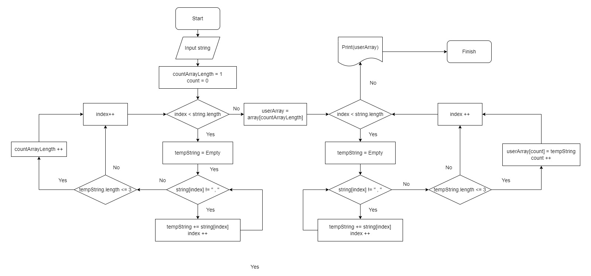

# GeekFinalHomeWork - I четверть

## Задача

  Написать программу, которая из имеющегося массива строк формирует массив из строк, длина которых меньше либо равна 3 символа.  
  Первоначальный массив можно ввести с клавиатуры, либо задать на старте выполнения алгоритма.  
  При решении не рекомендуется пользоваться коллекциями, лучше обойтись исключительно массивами.  

### **Алгоритм**

  1. 
В самом начале необходимо посчитать количество элементов в введенной строке для формирования массива. Так как в примере указано, что элемент может содержать пробел, то будем считать, что каждый элемент разделен запятой " , ". 

  2. 
Проходим по каждому элементу строки как по массиву и записываем во временную переменную до того момента пока не найдём " , ". Далее проверяем временную переменную на длину и если длина меньше либо равна 3 инкрементим счетчик.

  3. 
Создаем искомый массив с длинной равной счетчику.

  4. 
Повторяем действия п.2  с одним изменением - если длина меньше либо равна 3 записываем значение временной переменной в ранее созданный массив и переходим к следующему элементу.

  5. 
Вывод на экран заполненного массива.

  

### **Комментарии к готовому коду**

  1. 
П. 2 и п. 4 в алгоритме практически идентичны, поэтому логично выделить повторяющуюся часть в отдельный метод. 

  2. 
В примерах к задаче были составные вводимые элементы ("Computers science"), что ограничивает варианты использования разделителей между элементами. 
